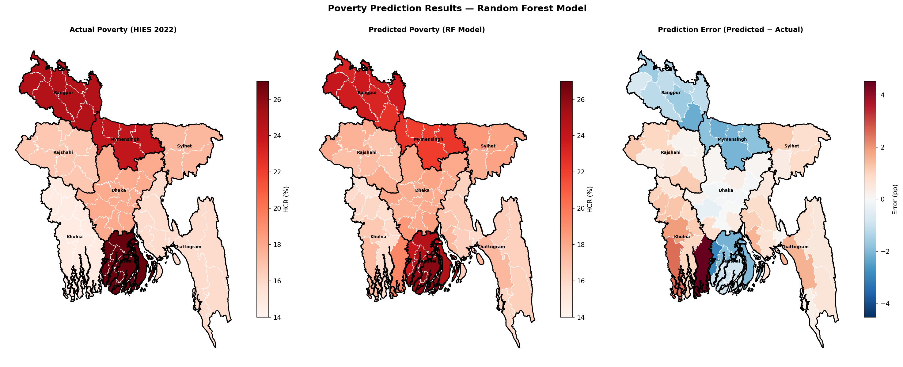

# 🛰️ Mapping Poverty from Space — Bangladesh

> Predicting district-level poverty in Bangladesh using satellite 
> nighttime light, vegetation indices, terrain data, and road 
> networks — without a single ground survey.

**ISRT · University of Dhaka · 2024**

[](https://povertypredictionbd-phjajjhjhoxmrkzgy7kxod.streamlit.app)

---

## 🗺️ Key Result



*Left: Actual poverty rates (HIES 2022). Centre: RF model 
predictions. Right: Prediction error by district.*

---

## 📊 Model Performance

| Model | RMSE (pp) | MAE (pp) | R² | Validation |
|-------|-----------|----------|-----|------------|
| Naive Baseline | 4.163 | 3.596 | 0.000 | LODO-CV |
| CNN ResNet-18 | 4.354 | 3.188 | -0.094 | LODO-CV |
| **Random Forest** | **3.626** | **2.926** | **0.241** | LODO-CV |

*LODO-CV = Leave-One-Division-Out Cross-Validation*

---

## 🔬 Key Findings

- **Poverty is strongly spatially clustered** — Moran's I = 0.733 
  (p < 0.001). Poor districts neighbor poor districts.
- **Neighboring NTL matters more than own NTL** — spatial lag 
  features contribute 29% of total RF importance.
- **Elevation dominates** (19.2% importance) — terrain geography 
  shapes economic development across Bangladesh.
- **CNN underperforms RF** with only 64 training samples — 
  tabular ML outperforms deep learning at this data scale.

---

## 📁 Project Structure
```
bangladesh-poverty-prediction/
├── data/
│   ├── raw/               # Raw GEE exports, shapefiles
│   └── processed/         # Master feature dataset
├── models/                # Trained RF model + scaler
├── notebooks/             # Analysis notebooks (01–10)
├── outputs/
│   ├── figures/           # Charts and visualizations
│   ├── maps/              # Choropleth maps
│   └── tables/            # Results tables
├── src/                   # Reusable Python modules
├── docs/                  # Documentation
├── lovable_app/           # React frontend + FastAPI backend
├── app.py                 # Streamlit dashboard
└── requirements.txt       # Python dependencies
```

---

## 🗂️ Data Sources

| Dataset | Source | Resolution |
|---------|--------|------------|
| Poverty labels | HIES 2022, Bangladesh BBS | Division level |
| Nighttime Light | VIIRS DNB, Google Earth Engine | ~500m |
| Vegetation (NDVI) | MODIS MOD13A3, GEE | 1km |
| Land Cover | ESA WorldCover v200, GEE | 10m |
| Elevation | SRTM, GEE | 30m |
| Population | WorldPop GP, GEE | 100m |
| Road Network | OpenStreetMap, OSMnx | Vector |
| Satellite Imagery | Sentinel-2, GEE | 100m |
| Boundaries | GADM 4.1 Level 2 | Vector |

---

## 🚀 How to Reproduce
```bash
# 1. Clone the repository
git clone https://github.com/raiyan-ahmed-khan/Poverty_Prediction_BD
cd Poverty_Prediction_BD

# 2. Create virtual environment
python -m venv .venv
source .venv/bin/activate  # Windows: .venv\Scripts\activate

# 3. Install dependencies
pip install -r requirements.txt

# 4. Run notebooks in order
# notebooks/01 → boundary verification
# notebooks/02 → nighttime light extraction (GEE)
# notebooks/03 → auxiliary features
# notebooks/04 → data merging
# notebooks/05 → EDA
# notebooks/06 → ML modeling
# notebooks/07 → Sentinel-2 export (GEE)
# notebooks/08 → SHAP analysis
# notebooks/09 → Lovable app preparation

# 5. Launch Streamlit dashboard
streamlit run app.py
```

---

## 🌐 Live Demo

- **Streamlit Dashboard:** https://povertypredictionbd-phjajjhjhoxmrkzgy7kxod.streamlit.app
- **API Docs:** https://bangladesh-poverty-api.onrender.com/docs

---

## 📄 Citation
```bibtex
@misc{khan2024poverty,
  author    = {Raiyan Ahmed Khan},
  title     = {Predicting Regional Poverty Levels in Bangladesh 
               Using Satellite Night-Light Data and Geospatial Features},
  year      = {2024},
  publisher = {ISRT, University of Dhaka},
  url       = {https://github.com/raiyan-ahmed-khan/Poverty_Prediction_BD}
}
```

---

## 🙏 Acknowledgements

- **Supervisor:** ISRT, University of Dhaka
- **Data:** Bangladesh Bureau of Statistics, Google Earth Engine, 
  ESA, NASA, OpenStreetMap contributors, WorldPop
- **Inspiration:** Jean et al. (2016) *Combining satellite imagery 
  and machine learning to predict poverty.* Science.
