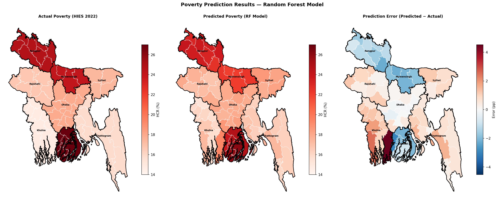

# Mapping Poverty from Space — Bangladesh

> Predicting district-level poverty in Bangladesh using satellite
> nighttime light, vegetation indices, terrain data, and road
> networks — without a single ground survey.

**ISRT · University of Dhaka · 2024**

[](https://povertypredictionbd-phjajjhjhoxmrkzgy7kxod.streamlit.app)
[](https://bangladesh-poverty-api.onrender.com/docs)
[](LICENSE)
[](https://www.python.org/)

---

## About This Project

Traditional poverty measurement relies on household surveys —
expensive, infrequent, and only available at coarse spatial scales.
In Bangladesh, the most recent national survey (HIES 2022) provides
poverty estimates for only 8 divisions, leaving 64 districts without
individual poverty data.

This project asks: **can satellite imagery and geospatial data replace
ground surveys for poverty estimation?**

I build an end-to-end machine learning pipeline that extracts 19
features from freely available satellite sources — nighttime light
radiance, vegetation indices, land cover, elevation, population density,
and road networks — for all 64 districts of Bangladesh, then trains
a Random Forest model to predict district-level poverty headcount ratios.

The key finding is that **where a district is matters more than what
it looks like** — the nighttime light of neighboring districts predicts
poverty better than a district's own light, confirming strong spatial
clustering (Moran's I = 0.733). We also compare tabular ML against a
transfer-learned ResNet-18 CNN trained on actual Sentinel-2 satellite
imagery, finding that Random Forest outperforms deep learning at this
sample size.

---

## What This Project Does

The pipeline covers the full research workflow across 9 notebooks:

1. **Data Collection** — extracts satellite features from Google Earth
   Engine (VIIRS, MODIS, ESA WorldCover, SRTM, WorldPop, Sentinel-2)
   and road networks from OpenStreetMap
2. **Data Merging** — combines all sources into a single master dataset
   of 64 districts × 30 features
3. **Exploratory Analysis** — correlation analysis, choropleth maps,
   and Moran's I spatial autocorrelation testing
4. **ML Modeling** — trains and compares 7 models under strict
   Leave-One-Division-Out spatial cross-validation
5. **Deep Learning** — fine-tunes ResNet-18 on 4-band Sentinel-2
   imagery (100m resolution) for poverty regression
6. **Deployment** — interactive Streamlit dashboard + FastAPI backend
   + React frontend for live poverty prediction

---

## Key Result



*Left: Actual poverty rates (HIES 2022). Centre: RF model
predictions. Right: Prediction error by district.*

---

## Model Performance

| Model | RMSE (pp) | MAE (pp) | R² | Validation |
|-------|-----------|----------|----|------------|
| Naive Baseline | 4.163 | 3.596 | 0.000 | LODO-CV |
| CNN ResNet-18 | 4.354 | 3.188 | -0.094 | LODO-CV |
| **Random Forest** | **3.626** | **2.926** | **0.241** | LODO-CV |

*pp = percentage points · LODO-CV = Leave-One-Division-Out Cross-Validation*

---

## Key Findings

- **Poverty is strongly spatially clustered** — Moran's I = 0.733
  (p < 0.001). Poor districts consistently neighbor poor districts.
- **Neighboring NTL matters more than own NTL** — the spatial lag of
  nighttime light (17.3% importance) outperforms a district's own
  light (2.3%), showing that geographic context dominates.
- **Elevation is the top predictor** (19.2% importance) — terrain
  geography shapes economic development across Bangladesh more than
  any single satellite measurement.
- **CNN underperforms RF** at this sample size — with only 64
  districts, tabular ML generalizes better than deep learning.
- **Spatial lag features collectively contribute 29%** of total
  Random Forest importance, validating the spatially-aware approach.

---

## Project Structure
```
Poverty_Prediction_BD/
├── data/
│   ├── raw/                   # Raw GEE exports, shapefiles
│   └── processed/             # Master feature dataset (64 × 30)
├── models/                    # Trained RF model, scaler, feature list
├── notebooks/
│   ├── 01_boundary_verification.ipynb
│   ├── 02_nighttime_light_extraction.ipynb
│   ├── 03_auxiliary_features.ipynb
│   ├── 04_data_merging.ipynb
│   ├── 05_eda.ipynb
│   ├── 06_ml_modeling.ipynb
│   ├── 07_sentinel2_export.ipynb
│   ├── 08_shap_export.ipynb
│   └── 09_lovable_prep.ipynb
├── outputs/
│   ├── figures/               # Charts and visualizations
│   ├── maps/                  # Choropleth maps
│   └── tables/                # Results tables (CSV)
├── docs/                      # Data dictionary, methodology, paper
├── lovable_app/
│   ├── backend/               # FastAPI prediction API
│   └── data/                  # GeoJSON and JSON for frontend
├── src/                       # Reusable Python modules
├── app.py                     # Streamlit dashboard
└── requirements.txt           # Python dependencies
```

---

## Data Sources

| Dataset | Source | Resolution | Period |
|---------|--------|------------|--------|
| Poverty labels | HIES 2022, Bangladesh BBS | Division level | 2022 |
| Nighttime Light | VIIRS DNB, Google Earth Engine | ~500m | 2018–2022 |
| Vegetation (NDVI) | MODIS MOD13A3, GEE | 1km | 2022 |
| Land Cover | ESA WorldCover v200, GEE | 10m | 2021 |
| Elevation | SRTM, GEE | 30m | — |
| Population Density | WorldPop GP, GEE | 100m | 2020 |
| Road Network | OpenStreetMap via OSMnx | Vector | 2024 |
| Satellite Imagery | Sentinel-2 SR, GEE | 100m | Nov 2022–Mar 2023 |
| Admin Boundaries | GADM 4.1 Level 2 | Vector | — |

---

## How to Reproduce
```bash
# 1. Clone the repository
git clone https://github.com/raiyan-ahmed-khan/Poverty_Prediction_BD
cd Poverty_Prediction_BD

# 2. Create virtual environment
python -m venv .venv
source .venv/bin/activate   # Windows: .venv\Scripts\activate

# 3. Install dependencies
pip install -r requirements.txt

# 4. Run notebooks in order (01 through 09)
jupyter lab

# 5. Launch Streamlit dashboard
streamlit run app.py

# 6. Run FastAPI backend locally (optional)
cd lovable_app/backend
uvicorn main:app --reload --port 8000
```

> **Note:** Notebooks 02, 03, and 07 require Google Earth Engine
> authentication (`ee.Authenticate()`). Run `earthengine authenticate`
> in your terminal before executing those notebooks.

---

## Live Demo

| Resource | Link |
|----------|------|
| 🖥️ Streamlit Dashboard | [povertypredictionbd.streamlit.app](https://povertypredictionbd-phjajjhjhoxmrkzgy7kxod.streamlit.app) |
| ⚙️ API Documentation | [bangladesh-poverty-api.onrender.com/docs](https://bangladesh-poverty-api.onrender.com/docs) |
| 📄 Research Paper | [PDF](docs/Bangladesh_Poverty_Prediction___Satellite_ML_research_paper.pdf) |

---

## Citation
```bibtex
@misc{khan2024poverty,
  author    = {Raiyan Ahmed Khan},
  title     = {Predicting Regional Poverty Levels in Bangladesh
               Using Satellite Night-Light Data and Geospatial Features},
  year      = {2024},
  publisher = {ISRT, University of Dhaka},
  url       = {https://github.com/raiyan-ahmed-khan/Poverty_Prediction_BD}
}
```

---

## Acknowledgements

- **Institution:** Institute of Statistical Research and Training (ISRT),
  University of Dhaka
- **Data providers:** Bangladesh Bureau of Statistics, Google Earth Engine,
  ESA Copernicus, NASA/USGS, OpenStreetMap contributors, WorldPop
- **Inspiration:** Jean et al. (2016) *Combining satellite imagery
  and machine learning to predict poverty.* Science, 353(6301), 790–794.